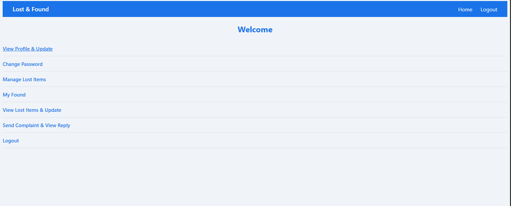
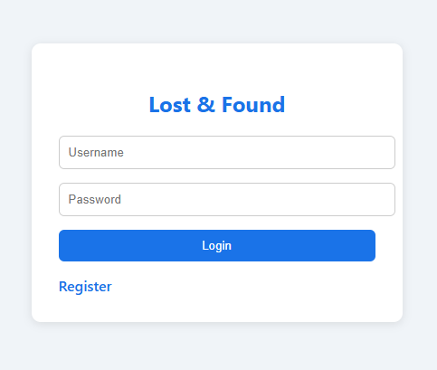
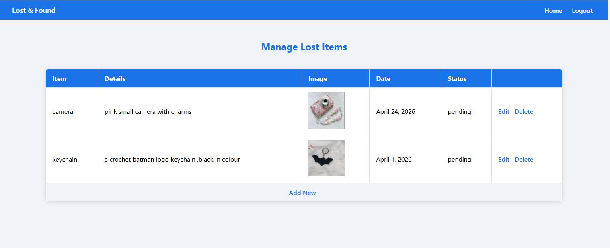
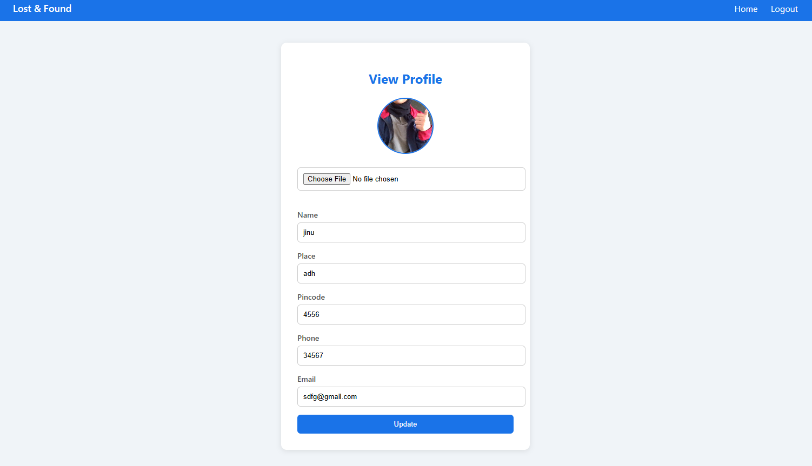

# Lost & Found Web Application

A simple and useful web application that helps people report and find lost items. Built with Python Django.

## About

We all lose things in our daily lives — whether it's something valuable or something we're attached to. This app makes it easy to report lost items and connect with people who may have found them.

## How It Works

- Report your lost item with details and an image
- Other users can see lost items and report if they found it
- The owner gets notified and can confirm if their item is found
- Stay connected through the complaint and reply system

## Features

### User
- Register and login
- Report lost items with image, details and date
- View lost items reported by others
- Mark an item as found
- Confirm if your lost item has been found
- Update profile
- Change password
- Send complaints and view admin replies

### Admin
- View all registered users
- View all lost items and update status
- View all found items
- Reply to user complaints

## Tech Stack

- Python
- Django
- SQLite
- HTML/CSS

## Installation

1. Clone the repository
https://github.com/fathimarashap/lost-and-found.git
2. Install dependencies
pip install -r requirements.txt

##  Screenshots

### Home Page

### Login Page

### Lost Items Page

### Profile Page

