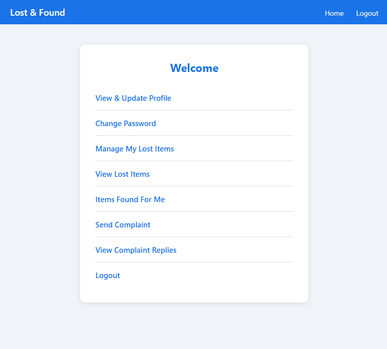
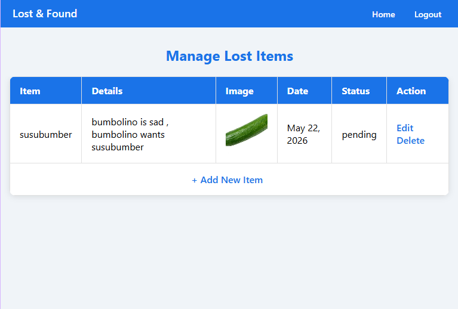
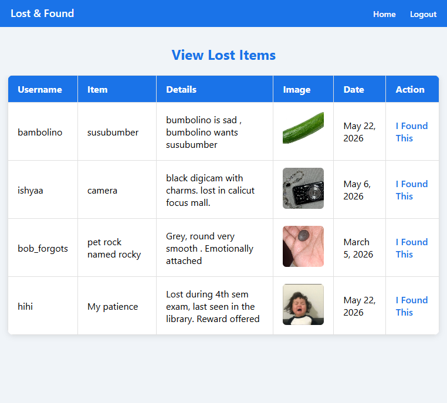
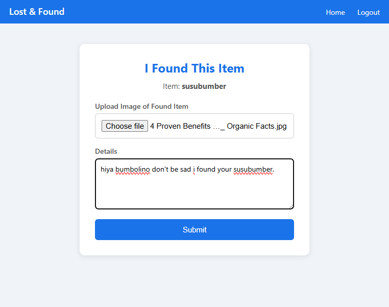
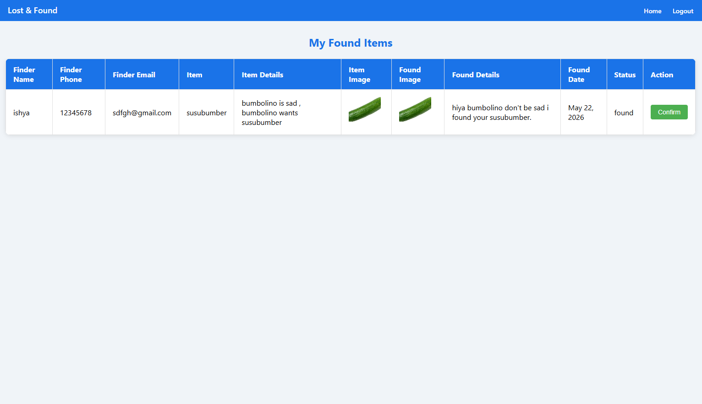
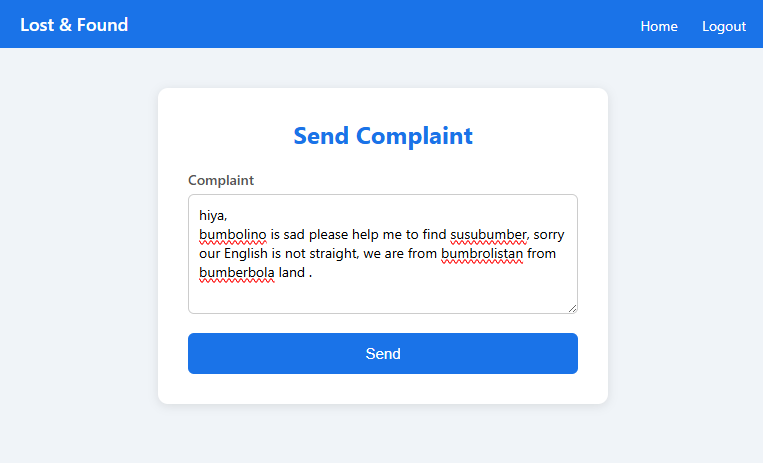
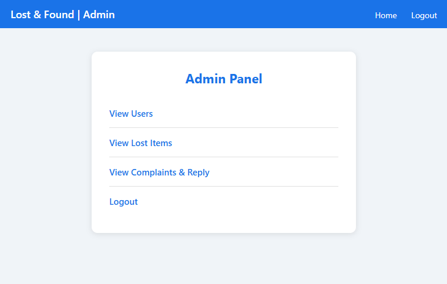

# Lost & Found Web Application

A web application built with Django that helps people report and recover lost items in their community.

## Features

### User
- Register and login securely
- View and update profile
- Report lost items with image and details
- Browse lost items reported by others
- Report finding someone's lost item
- Confirm when your lost item has been found
- Send complaints and view admin replies

### Admin
- View all registered users
- View all lost items
- Reply to user complaints

## Tech Stack

- **Backend:** Python, Django
- **Database:** PostgreSQL (Railway)
- **Image Storage:** Cloudinary
- **Deployment:** Railway
- **Frontend:** HTML, CSS (mobile responsive)

## Screenshots

### User Home


### Manage Lost Items


### Edit Lost Item


### I Found This Item


### Confirm Found Item


### Profile Page


### Send Complaint


### Admin Panel


## Live Demo

[https://web-production-6fa33.up.railway.app/login/](https://web-production-6fa33.up.railway.app/login/)

## Setup Instructions

### Prerequisites
- Python 3.x
- pip

### Installation

1. Clone the repository
```bash
git clone https://github.com/fathimarashap/lost-and-found.git
cd lost-and-found
```

2. Install dependencies
```bash
pip install -r requirements.txt
```

3. Set environment variables
```
SECRET_KEY=your_secret_key
CLOUDINARY_CLOUD_NAME=your_cloud_name
CLOUDINARY_API_KEY=your_api_key
CLOUDINARY_API_SECRET=your_api_secret
DATABASE_URL=your_database_url
```

4. Run migrations
```bash
python manage.py migrate
```

5. Start the server
```bash
python manage.py runserver
```

## Notes

- Passwords are hashed using Django's built-in password hashers
- Media files are stored on Cloudinary
- Database is hosted on Railway PostgreSQL